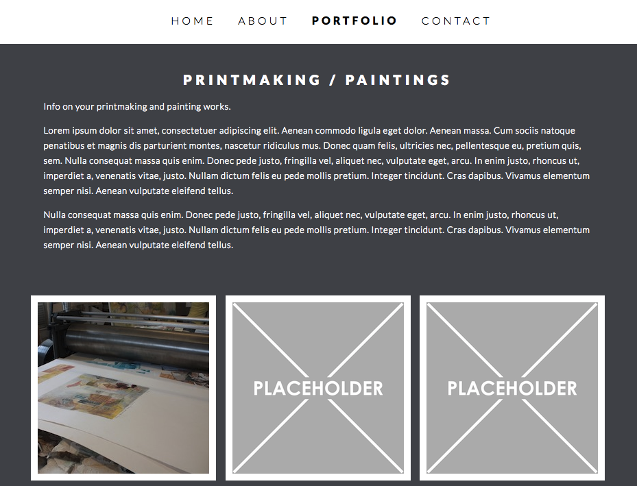

# Katie Rafferty Portfolio Website
---
## [Live Demo](http://katie-rafferty.bitballoon.com/#)

## What It Is
Portfolio Website for New Orleans artist Katie Rafferty. Katie commissioned me to work on a website to showcase her art and her process. I worked with her over a period of a few months to talk about what she wanted out of the site, her ideas on style and how she wanted to present herself online. We are still working out some details regarding content and branding.

## What I used
* HTML
* CSS
* jQuery
* lightbox - jQuery plugin to view thumbnail images larger.
* slick - jQuery plugin for carousel on homepage.


## Site Walkthrough

### Landing page
Simple landing page with carousel to show off Katie's art.
<p align='center'>
    </img>
</p>

### About page
This page has 3 sections - About Katie, My Studio and My Press. These are sections the client wanted on this page to tell visitors about herself and how she makes her art.
<p align='center'>
    </img>
</p>

### Portfolio page
This page has 2 sections - Printmaking/Painting and Commissions. Again these sections were requested by the client
<p align='center'>
    </img>
</p>

### Contact page
Shows client's contact info and brief message.
<p align='center'>
    </img>
</p>

## Challenges

### Challenge 1 - Adding a stick navbar
I like the look of a transparent navigation bar that stays at the top of the page. Especially for websites that have a lot of content. I looked at a lot of blogs and tutorial sites and saw a variety of ways to do this. I ended up going with a combination of jQuery and CSS.

JavaScript code adding and removing the class "sticky" depending on the vertical scroll position I get from the scrollTop method.
```JavaScript
$(window).scroll(function() {
if ($(this).scrollTop() > 1) {  
    $('.nav').addClass("sticky");
  }
  else{
    $('.nav').removeClass("sticky");
  }
});
```
CSS for sticky class. Adds fixed position and opacity, z-index makes sure it's always on top of the rest of the page's content.
```CSS
.sticky {
	position: fixed;
	z-index: 1000;
	width: 100%;
	opacity: 0.9;
}
```
<p align='center'>
    </img>
</p>


### Challenge 2 - working with a client
This is the first time I've built a website that was commissioned by a client. It was a very good learning experience to collaborate with a client, get her feedback and then add features that she wanted. To start the process, I sent over a kind of prototype website just to send her something she could actually look at and give me suggestions from there. She ended up being pretty happy with the overall design. We'd have periodic phone calls and she'd tell me what she wanted changed, and in turn I would email her with a review of what we discussed, and an outline of the information I need back from her in order to continue. And we'll continue to do this in regular intervals until the site is where she wants it to be. 
